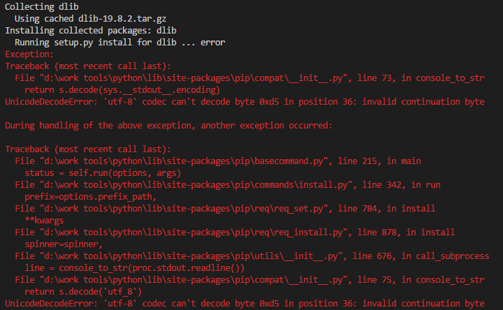
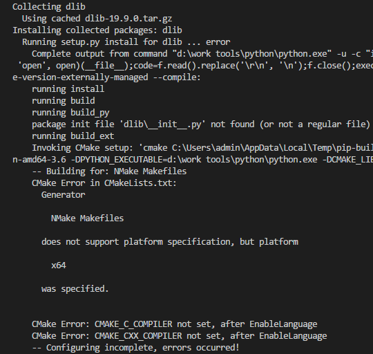
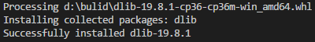
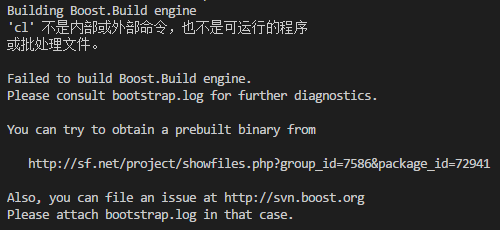
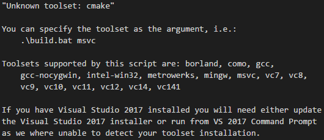
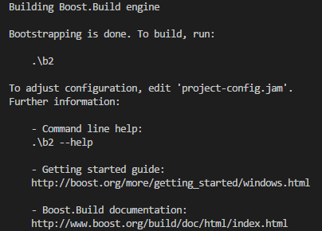
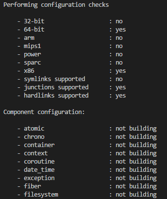
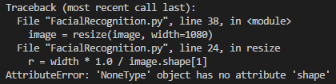

# Facial Recognition Log
Facial Recognition 记录开发中遇到的问题的日志
    
## 遇到的问题

    遇到问题 -> 记录 -> 寻找解决方案 -> 记录解决过程

## 【Dlib】

### **1. UnicodeDecodeError: 'utf-8' codec can't decode byte 0xd5**

    pip install dlib

使用 **pip install dlib** 后出现错误

查了一下相关的结果，应该是和 **python** 版本有关

**尝试**

 1. 切换 python 版本：没有效果问题依旧
 2. 安装 CMake 后执行：新错误

### **2. Running setup.py install for dlib ... error**

然后查找了相关文章，编译器的 **path** 未指定，在配置了编译器的 **path** 之后，报出新错误。

时间：2018年1月24日11点42分，我已经搞了2天了，尝试了很多方法包括使用CMAKE-GUI编译，配置了N多次环境，甚至把路径直接指定到了*.EXE，然而还是报这个错误。

所以我放弃！！！然后开始尝试 **\*.whl** 模式安装。

> *注：后来再去看 **dlib source** 的时候才发现，这东西要想在 **indows** 下编译安装  是完全依赖于 **MSVC** 的。  
如果你已经装了 **Visual Studio** 又想折腾一下的话……  
**Hey man, Good Luck for you!**

### **3. whl 方式**

    pip install dlib-19.8.1-cp36-cp36m-win_amd64.whl

Done!!!

## 【Boots】

### **1. bootstrap.bat 缺少CL**

运行 **bootstrap.bat** 后报错

应该是缺少 **CL** 的环境配置，然而 **CL** 是 **Microsoft Visual C++** 的编译器。

**尝试**

1. 命令改为使用 **CMake** : `$ bootstrap.bat cmake`

虽然不报缺少 **CL** 了，但还是无法编译，查看日志

看来还是需要使用 C++ 系列编译器来编译

2. 使用 **TDM-GCC** 编译

在 **MSVC** 和 **TDM-GCC** 之间选择， **MSVC** 的体积让我望而却步，转而投入 **GCC** 的怀抱

安装完成后，使用命令: `$ bootstrap.bat gcc`  
嗯~大约等了1分钟左右  
Done!

### **2. boots to python: Did not find command for MSVC toolset**

编译完成 **boots** 后会生成文件

    b2.exe
    bjam.exe
    project-config.jam

这里直接按着提示 `.\b2 --help` 会输出可用命令  
不过这里我使用了：

    bjam --stagedir=D:\build --with-python link=shared threading=multi variant=release runtime-link=shared stage

[命令解释参考](https://www.cnblogs.com/lidabo/p/3782193.html)
生成 Release 版本，多线程，动态链接C++标准库 的 xxx 动态库

    bjam --stagedir=path --with-xxx link=shared threading=multi variant=release runtime-link=shared stage
    --stagedir=     输出目录，不支持中文，空格
    --with-xxx      编译的语言
    link=           static|shared 使用库：静态库、动态库
    threading=      single|multi 使用线程：单线程、多线程库
    runtime-link=   static|shared 链接C/C++标准库：静态、动态
    stage 使用输出目录，指向 --stagedir

然而，当我直接使用以上命令时：

    warning: Did not find command for MSVC toolset. If you have Visual Studio 2017 installed you will need to specify the full path to the command, set VS150COMNTOOLS for your installation, or build from the 'Visual Studio Command Prompt for VS 2017'.
    ......

还是无法能够正确编译，在搜索了一些相关问题的时候发现可以更改 **project-config.jam** 里的 **using msvc ;** 部分。  
然后我将 **using msvc ;** 更改为 **using gcc ;** 再次运行命令

编译时长与机器性能相关  
Done!

## 【scikit-image】

面部识别部分依赖 **scikit-image**

    pip install scikit-image

error: Microsoft Visual C++ 14.0 is required. Get it with "Microsoft Visual C++ Build Tools": http://landinghub.visualstudio.com/visual-cpp-build-tools

严重依赖 **MSVC**

## 【Code 部分】

### **1. Usage: FacialRecognition.py \<image file\>**

    python FacialRecognition.py

略……提示已经很明显了！

### **2. AttributeError: 'NoneType' object has no attribute 'shape'**

    python FacialRecognition.py url

我以为是使用了 **url** 的问题，然后换成了 **filepath** ，结果依旧……

然后在错误的行打印了获取的对象，running…… return None.

后来去查询了资料：

    调用opencv，就算图像的路径是错的，OpenCV 也不会提醒你的，但是当你使用命令print img 时得到的结果是 None。

OK，原来是这样，然后 改成了 **dir** 的方式。

    python FacialRecognition.py ./Imgs/face.jpg

Done!